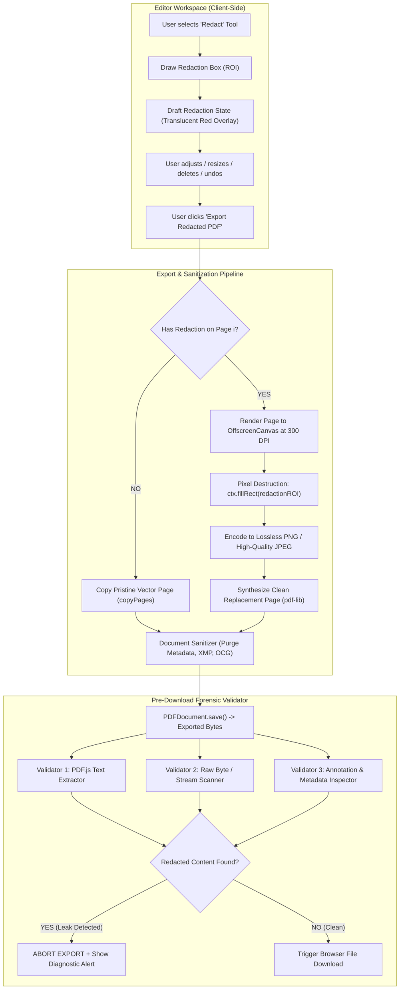

# Phase 5: True Secure Redaction — Architecture Specification

**Document:** `docs/phase5-redaction-architecture.md`  
**Status:** Design Proposal — **Awaiting Approval Before Implementation**

---

## 1. Architectural Blueprint

The core architecture follows a **Fail-Closed Dual-Pipeline Model**:



---

## 2. Redaction Lifecycle: Draft vs. Applied vs. Exported

To ensure user flexibility, accidental loss prevention, and full non-destructive editing in the workspace, redaction adheres to a three-stage lifecycle:

```
[1. DRAFT STAGE]
User drags redaction box
  - Displayed as semi-transparent red box with black crosshatch (#ef4444 with 35% opacity)
  - Underlying text and images remain visible to the user for precise alignment
  - Full Undo / Redo / Move / Resize / Delete supported in editorStore
  - Underlying original PDF buffer remains completely untouched

[2. PRE-EXPORT CONFIRMATION]
User clicks "Export Redacted PDF"
  - Interactive modal displays summary:
    "3 redaction regions on 2 pages will be permanently burned in.
     Redacted pages will be rasterized to guarantee underlying text and images cannot be recovered.
     Document metadata will be stripped."
  - User can proceed or cancel back to editor.

[3. APPLIED & VALIDATED EXPORT]
Clean page synthesis runs
  - Target pages are rendered offscreen at 300 DPI (scale ~4.167)
  - Redaction boxes are filled with solid black pixels: rgb(0, 0, 0)
  - Original page content streams, fonts, and XObjects for redacted pages are discarded
  - Pre-download forensic scanner confirms zero leakage
  - Clean PDF downloaded to user machine
```

---

## 3. Redaction Object Model

In [`src/utils/editorState.ts`](file:///c:/Users/A/Desktop/pdf%20tool%20web%20dev/src/utils/editorState.ts), the redaction object will be defined as an explicit extension of `BaseEditorObject`:

```typescript
export interface RedactionEditorObject extends BaseEditorObject {
  type: 'redact';
  status: 'draft' | 'applied';
  fillColor: string;       // Default: '#000000'
  overlayText?: string;    // Optional label (e.g. "[REDACTED]" or "REDACTED B(6)")
  fontSize?: number;       // For overlay text
  textColor?: string;      // Default: '#ffffff'
  originalText?: string;   // For validation audit (never exported!)
}
```

### 3.1 State Transitions
- **Creation**: `editorStore.addObject({ type: 'redact', status: 'draft', ... })`.
- **Modification**: Can be moved, resized with handles (`nw`, `ne`, `se`, `sw`), or deleted.
- **Undo / Redo**: Participates in standard transactional history (`EditorHistoryEntry`). Pressing `Ctrl+Z` removes the draft redaction cleanly without affecting the underlying document bytes.

---

## 4. The Clean Page Synthesis Pipeline

### 4.1 Page-by-Page Selective Processing
To preserve the highest possible visual and architectural quality:
1. **Unredacted Pages**:
   - Copied directly using `outDoc.copyPages(srcDoc, [i])`.
   - Retain 100% of their original native vector fonts, selectable text, vector diagrams, and minimal file size.
2. **Redacted Pages**:
   - Only pages containing at least one `RedactionEditorObject` are routed to the raster destruction pipeline.
   - Preserves vector fidelity on the remaining 95%+ of the document in typical use cases.

### 4.2 Pixel Obliteration Procedure
For each redacted page:
```typescript
// 1. Calculate high-resolution scale (300 DPI = 300 / 72 ≈ 4.1667)
const RASTER_DPI = 300;
const scale = RASTER_DPI / 72;
const viewport = pageProxy.getViewport({ scale, rotation: pageState.rotation });

// 2. Instantiate OffscreenCanvas (or standard HTML5 Canvas)
const canvas = document.createElement('canvas');
canvas.width = Math.round(viewport.width);
canvas.height = Math.round(viewport.height);
const ctx = canvas.getContext('2d', { alpha: false, willReadFrequently: true })!;

// 3. Render page base via PDF.js
await pageProxy.render({ canvasContext: ctx, viewport }).promise;

// 4. Burn redaction regions directly into pixel buffer
for (const redact of pageRedactions) {
  const screenRect = pdfRectToScreenRect(redact, viewport);
  ctx.fillStyle = redact.fillColor || '#000000';
  ctx.fillRect(screenRect.left, screenRect.top, screenRect.width, screenRect.height);

  if (redact.overlayText) {
    ctx.fillStyle = redact.textColor || '#ffffff';
    ctx.font = `bold ${Math.round((redact.fontSize || 12) * scale)}px sans-serif`;
    ctx.textAlign = 'center';
    ctx.textBaseline = 'middle';
    ctx.fillText(
      redact.overlayText,
      screenRect.left + screenRect.width / 2,
      screenRect.top + screenRect.height / 2
    );
  }
}

// 5. Convert to clean image buffer
const blob = await new Promise<Blob>((resolve) => canvas.toBlob((b) => resolve(b!), 'image/png'));
const imageBytes = new Uint8Array(await blob.arrayBuffer());

// 6. Embed in outDoc and substitute for original page
const embeddedImg = await outDoc.embedPng(imageBytes);
const newPage = outDoc.addPage([pageState.width, pageState.height]);
newPage.drawImage(embeddedImg, {
  x: 0,
  y: 0,
  width: pageState.width,
  height: pageState.height,
});
```

---

## 5. Geometry & Coordinate System Invariance

### 5.1 Authoritative PDF Points
All redaction coordinates in `editorStore` are stored in standard PDF points:
- Unit: $1\text{ pt} = \frac{1}{72}\text{ inch}$
- Origin: Top-Left of page (consistent with the web editor model)
- Conversion to PDF native bottom-left: $y_{\text{pdf}} = \text{pageHeight} - y_{\text{editor}} - \text{height}$

### 5.2 Rotation & Viewport Transforms
The existing [`coordinateMapper.ts`](file:///c:/Users/A/Desktop/pdf%20tool%20web%20dev/src/utils/coordinateMapper.ts) 4-corner bounding box projection ensures that regardless of page rotation (0°, 90°, 180°, 270°), the coordinates mapped to the high-resolution canvas match the exact visual region selected by the user.

---

## 6. Pre-Export Forensic Validation Subsystem

Before any redacted PDF is handed to the user for download, it must pass through an automated **in-memory validator**:

```typescript
export interface ValidationResult {
  passed: boolean;
  leaks: string[];
}

export async function validateRedactedPdf(
  exportedBytes: Uint8Array,
  redactions: RedactionEditorObject[]
): Promise<ValidationResult> {
  const leaks: string[] = [];

  // TEST 1: PDF.js Text Content Scan
  const doc = await pdfjsLib.getDocument({ data: exportedBytes }).promise;
  for (const redact of redactions) {
    if (!redact.originalText || redact.originalText.trim().length === 0) continue;
    const page = await doc.getPage(redact.pageNumber);
    const content = await page.getTextContent();
    const fullText = content.items.map((it: any) => it.str).join(' ');
    if (fullText.includes(redact.originalText)) {
      leaks.push(`Text leak on page ${redact.pageNumber}: "${redact.originalText}" found in text layer!`);
    }
  }

  // TEST 2: Raw Binary String Scan (for uncompressed or flate residual tokens)
  const binaryString = Buffer.from(exportedBytes).toString('latin1');
  for (const redact of redactions) {
    if (!redact.originalText || redact.originalText.length < 3) continue;
    if (binaryString.includes(redact.originalText)) {
      leaks.push(`Binary leak: Plaintext string "${redact.originalText}" found in raw PDF byte stream!`);
    }
  }

  return {
    passed: leaks.length === 0,
    leaks,
  };
}
```

If `passed === false`:
- **Export is immediately blocked**.
- A high-priority error modal warns the user with diagnostic details.
- No compromised PDF is ever written to disk or downloaded.

---

## 7. Document Sanitization Subsystem

In addition to page-level content redaction, the export engine will offer **Full Document Sanitization**:
1. **Purge `/Info` Dictionary**: Remove `Title`, `Author`, `Subject`, `Keywords`, `Creator`, `Producer`, `CreationDate`, `ModDate`.
2. **Purge `/Metadata` Stream**: Remove the XML XMP packet (`<x:xmpmeta>`) that frequently holds original unredacted metadata and editing history.
3. **Purge Page Annotations**: Remove all annotations intersecting the redaction region from `/Annots`.
4. **Purge Form Widgets**: Clear AcroForm fields and widget dictionaries in redacted areas.
5. **Purge JavaScript**: Strip document-level `/JavaScript` and `/JS` action dictionaries.
6. **Purge Embedded Attachments**: Remove `/EmbeddedFiles` from the document Catalog.

---

## 8. UX & User Interaction Design

1. **Toolbar Button**:
   - The Redact button in [`EditorToolbar.astro`](file:///c:/Users/A/Desktop/pdf%20tool%20web%20dev/src/components/editor/EditorToolbar.astro) is activated when Phase 5 is accepted.
   - Icon: Solid black rectangle icon with clear "Redact" label.
2. **Draft Drawing**:
   - Click-and-drag creates a red crosshatch box labeled "REDACTION PREVIEW".
   - Handles allow corner resizing and repositioning.
3. **Inspector Pane**:
   - Dedicated "Redaction Properties" pane in [`EditorInspector.astro`](file:///c:/Users/A/Desktop/pdf%20tool%20web%20dev/src/components/editor/EditorInspector.astro).
   - Allows choosing overlay fill color (Black, White) and optional overlay text (e.g. `[REDACTED]`, `CONFIDENTIAL`).
4. **Pre-Export Modal**:
   - Summarizes the exact number of redactions and warns about page flattening.
   - Includes checkbox: `☑ Strip document metadata, author, and revision history (Recommended)`.
