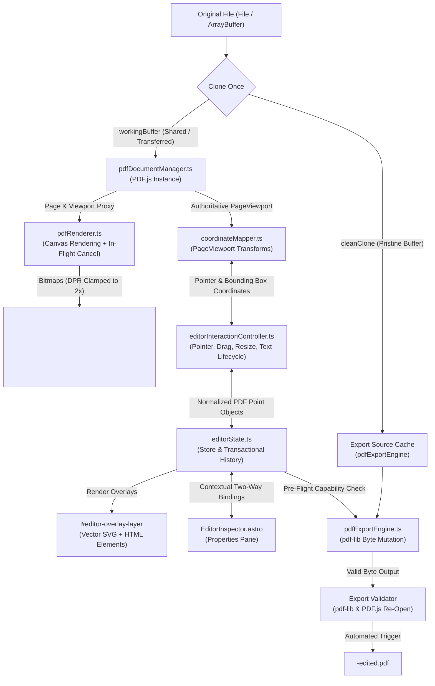

# PDF Editor — Phase 2: Engine & Client-Side Export Specification

## 1. System Architecture & Module Boundaries

The Phase 2 engine transforms the Phase 1 UI shell into a true client-side PDF rendering, interactive annotation, and byte-level export application. It adheres strictly to:

$$\text{CORRECTNESS} > \text{ARCHITECTURAL QUALITY} > \text{PERFORMANCE} > \text{FEATURE COUNT}$$



### Module Responsibilities

1. **`src/utils/pdfDocumentManager.ts`**:
   - Manages the active `PDFDocumentProxy` via `pdfjs-dist`.
   - Configures the PDF.js web worker cleanly in Astro/Vite using `import pdfjsWorker from 'pdfjs-dist/build/pdf.worker.min.mjs?url'`.
   - Manages memory for large files (e.g., 876 pages, 211.7 MB): retains only active page references, lazy-loads page proxies, and destroys documents cleanly on file close.
   - Holds a dedicated pristine clone of the original `ArrayBuffer` (`fileBytes.slice(0)`) reserved strictly for `pdf-lib` export.

2. **`src/utils/pdfRenderer.ts`**:
   - Renders a requested PDF page to `<canvas id="pdf-canvas">`.
   - **In-flight Cancellation**: Keeps a reference to the active `RenderTask`. If the user rapidly switches pages or changes zoom, calls `renderTask.cancel()` before starting the next render, suppressing `RenderingCancelledException`.
   - **DPR Scaling**: Clamps backing canvas pixel ratio to `Math.min(window.devicePixelRatio || 1, 2)` to eliminate OOM crashes on high-res Retina displays and large page sizes.
   - Sets canvas CSS style dimensions to exact `viewport.width` and `viewport.height`.

3. **`src/utils/coordinateMapper.ts`**:
   - The authoritative coordinate translation layer powered directly by the active PDF.js `PageViewport`.
   - Never uses simplified `x * zoom` approximations.
   - Handles page scale, rotation (0, 90, 180, 270 degrees), viewport scroll offsets, and CSS layout centering.
   - Functions:
     - `screenToPdfPoint(clientX, clientY, canvasRect, viewport)`: Maps screen pointer coordinates to native PDF points ($72\text{ dpi}$, standard top-left PDF origin for the editor state).
     - `pdfPointToScreen(x, y, viewport)`: Maps PDF point coordinates to canvas-relative CSS pixels for overlay positioning.
     - `pdfToPdfLibCoords(x, y, width, height, pageHeight)`: Inverts the Y-axis for `pdf-lib` export ($y_{\text{pdflib}} = \text{pageHeight} - y - \text{height}$).

4. **`src/utils/editorInteractionController.ts`**:
   - Centralizes all pointer and keyboard events on `#editor-overlay-layer`.
   - Manages interactive states: Idle, Creating Shape, Drawing Pen, Inline Text Editing, Selecting, Moving, and Resizing.
   - Dispatches single consolidated history transactions on gesture completion (`pointerup`).

5. **`src/utils/pdfExportEngine.ts`**:
   - Performs pre-flight capability check on all document objects.
   - Loads the pristine original PDF buffer via `pdf-lib`'s `PDFDocument.load()`.
   - Burns annotations using native vector primitives, standard fonts (`StandardFonts.Helvetica`, `HelveticaBold`, `TimesRoman`, `Courier`), and embedded image/signature bitmaps.
   - Runs automated post-export validation before triggering the download.

---

## 2. Authoritative Coordinate System

### Coordinate Definitions
1. **Document Page Coordinates (Authoritative)**:
   - Stored in `EditorObject` schemas in `editorState.ts`.
   - Units: PDF Points ($1\text{ pt} = 1/72\text{ inch}$).
   - Origin: Top-Left of the PDF crop/media box $(0, 0)$.
   - Invariant: When the user zooms, resizes the browser window, or scrolls, the stored $(x, y, w, h)$ values do NOT change.

2. **Rendered CSS Screen Coordinates**:
   - Units: CSS Pixels.
   - Derived dynamically via `viewport.convertToViewportPoint(x, y)`.
   - PDF.js `PageViewport` automatically applies the transformation matrix:
     $$\begin{bmatrix} x_{\text{css}} \\ y_{\text{css}} \end{bmatrix} = \mathbf{M}_{\text{viewport}} \begin{bmatrix} x_{\text{pdf}} \\ y_{\text{pdf}} \end{bmatrix}$$
   - Handles arbitrary zoom levels (25% to 300%) and page rotations ($0^\circ, 90^\circ, 180^\circ, 270^\circ$).

3. **`pdf-lib` Native Coordinates**:
   - Units: PDF Points ($72\text{ dpi}$).
   - Origin: Bottom-Left $(0, 0)$.
   - Mapping:
     $$x_{\text{pdflib}} = x$$
     $$y_{\text{pdflib}} = \text{pageHeight} - y - h$$

---

## 3. Separation of Rendering vs. Editing

- **PDF.js**: Responsible exclusively for rasterizing existing PDF content to `<canvas id="pdf-canvas">`. It does not manage UI annotations or track editing state.
- **Overlay Layer (`#editor-overlay-layer`)**: A transparent DOM/SVG container positioned directly over the canvas with identical dimensions and CSS transforms. All user annotations (text boxes, vector shapes, pen paths, highlights) reside here as discrete DOM/SVG elements.
- **Editor State (`editorStore`)**: Pure, decoupled TypeScript state manager. Contains zero DOM references and zero PDF.js or `pdf-lib` instances.
- **`pdf-lib`**: Responsible exclusively for byte mutation during export.

---

## 4. Pristine Export-Safe Byte Pipeline

To guarantee that export never suffers from byte mutations, transfers, or detachment caused by PDF.js worker transfers:

1. When a `File` or `ArrayBuffer` is loaded via `handleSelectedFile(file)`:
   ```ts
   const rawBytes = await file.arrayBuffer();
   // Dedicated pristine clone reserved strictly for export:
   const pristineExportBytes = rawBytes.slice(0);
   // Working buffer passed to PDF.js:
   const workingBytes = new Uint8Array(rawBytes);
   ```
2. `pristineExportBytes` is stored in the document manager cache.
3. For large PDFs (e.g. 211 MB), cloning occurs **exactly once** upon file loading. No repeated cloning occurs during page switching, zooming, or editing.

---

## 5. Interaction Model & Tool Specifications

### 5.1 Add Text Tool Lifecycle
- **Beginner-First Workflow**:
  1. User selects "Text" tool from the toolbar (or presses `T`).
  2. User clicks anywhere on the active PDF page.
  3. An inline `<div contenteditable="true">` mounts immediately at the exact click point.
  4. User types text.
- **Keybindings & Commit Rules**:
  - `Enter`: Inserts a standard newline (`\n`), enabling multiline annotations.
  - `Ctrl + Enter` (or `Cmd + Enter` on macOS): **Commits** the text annotation.
  - `Escape`: **Cancels** editing without saving.
  - `Blur` (clicking outside): If trimmed text is non-empty, **commits**; if empty, cleanly removes the ephemeral editor.
- **Re-editing**: Double-clicking an existing text object re-opens the inline editor; clicking once selects it for moving, resizing, and inspector styling.
- **Honesty**: Phase 2 explicitly supports **Adding New Text**, not editing existing embedded PDF vector/glyph streams.

### 5.2 Shape Tools (Rectangle, Ellipse, Line, Arrow, Whiteout)
- `pointerdown`: Locks origin point $(x_0, y_0)$ in PDF points. Mounts an active ghost SVG preview element.
- `pointermove`: Updates preview bounds in real time. Normalizes negative dimensions if dragged upward/leftward.
- `pointerup`: Finalizes bounds, creates `ShapeEditorObject`, commits to `editorStore` in a single history step, and resets tool to `select`.

### 5.3 Freehand Pen Tool
- `pointerdown`: Initializes point array `[{ x, y }]`.
- `pointermove`: Records points at $60\text{ fps}$, renders a smoothed SVG quadratic Bezier path `<path d="M ... Q ...">`.
- `pointerup`: Commits smoothed SVG path string to `editorStore` as a single object.

### 5.4 Highlight Tool
- **Screen Representation**: Rendered on `#editor-overlay-layer` as a semi-transparent colored SVG rectangle (`opacity: 0.35`, `mix-blend-mode: multiply`).
- **Export Representation**: In `pdf-lib`, highlights are drawn using `page.drawRectangle()` with explicit `opacity: 0.35` and `color: rgb(...)` in the PDF graphics state. It does NOT rely on browser CSS blend modes.

### 5.5 Whiteout Tool
- **Definition & Honesty**: Whiteout is an opaque white vector rectangle (`fill: #ffffff`, `stroke: none`, `opacity: 1.0`).
- **Security Notice**: Explicitly labeled in the UI and documentation: *"Visual covering only. Does not sanitize or remove underlying PDF stream text."*

### 5.6 Signature Tool
- User clicks "Signature" tool $\rightarrow$ Opens a lightweight modal signature pad.
- User draws signature on the pad $\rightarrow$ Clicks "Adopt & Place".
- Modal converts canvas to PNG Data URL, places an `ImageEditorObject` on the page ready for moving/resizing.

### 5.7 Image Insertion Tool
- User clicks "Image" tool $\rightarrow$ Opens native file picker (`image/png, image/jpeg`).
- File is read as Data URL, natural dimensions are probed, and placed as an `ImageEditorObject` maintaining aspect ratio.

---

## 6. History, Undo & Redo Architecture

- **Granularity**: Undo/Redo stores mutations to `editorStore.objects` only. Complete PDF ArrayBuffers or canvas bitmaps are **never** stored in history.
- **Gestural Transactions**: Pointer gestures (`pointerdown` $\rightarrow$ multiple `pointermove`s $\rightarrow$ `pointerup`) emit exactly **one** history entry on `pointerup`.
- **Supported Transactions**:
  - `create`: Addition of any object.
  - `delete`: Removal of selected object (`Delete` / `Backspace` key).
  - `transform`: Move or resize gesture.
  - `property`: Change in color, font size, stroke width, opacity from Inspector.
- **Bounded Depth**: Maximum 30 history states (FIFO eviction) to guarantee zero memory leaks.

---

## 7. Client-Side Export Engine (`pdf-lib`)

### Pre-Flight Capability Check
Before processing export, the engine scans all objects:
```ts
const supportedTypes = ['text', 'rectangle', 'ellipse', 'line', 'arrow', 'pen', 'highlight', 'whiteout', 'image', 'signature'];
const unsupported = objects.filter(o => !supportedTypes.includes(o.type));
if (unsupported.length > 0) {
  // Show user-facing warning modal listing unsupported items before proceeding
}
```

### Native Drawing Mappings
- **Standard Fonts**: Uses `StandardFonts.Helvetica`, `StandardFonts.HelveticaBold`, `StandardFonts.TimesRoman`, `StandardFonts.Courier`. No heavy custom TTF/WOFF font embedding required in Phase 2.
- **Y-Coordinate Inversion**:
  $$y_{\text{pdflib}} = \text{page.getHeight}() - (y + \text{height})$$
- **Shapes & Lines**: Drawn via `page.drawRectangle()`, `page.drawEllipse()`, `page.drawLine()`, and `page.drawSvgPath()`.
- **Images & Signatures**: Data URLs are converted to bytes and embedded via `pdfDoc.embedPng()` or `pdfDoc.embedJpg()`.

### Export Progress UI & Validation
- Replaces any `alert()` calls with an in-app non-modal progress toast:
  - *"Preparing PDF..."*
  - *"Applying annotations (Page X of Y)..."*
  - *"Validating document integrity..."*
  - *"Download started!"*
- **Integrity Validation**: The generated `Uint8Array` is tested by re-loading into `PDFDocument.load()` and PDF.js before dispatching the browser download.
- **Download Naming**: Output file is named `<original-basename>-edited.pdf`.

---

## 8. Large-PDF Safety & Performance Strategy

To maintain smooth 60fps interaction and prevent crashes on large files (tested with 876 pages, ~211.7 MB):
1. **Single Canvas Rendering**: Only the active page canvas is rendered at full backing resolution.
2. **Render Cancellation**: Any in-flight `RenderTask` is canceled (`renderTask.cancel()`) immediately upon page change or zoom adjustment.
3. **DPR Clamping**: Canvas pixel buffer is clamped to $2.0\times$ max DPR.
4. **Lazy Thumbnails**: Thumbnails are rendered lazily via `IntersectionObserver` or capped to visible range (max 30 initial thumbnails with virtual scrolling placeholder for remaining pages).
5. **Single ArrayBuffer Clone**: Cloned once on load; no repeated buffer duplication.

---

## 9. Capability Matrix & Feature Truth

| Tool / Capability | Phase 2 Status | Honest Technical Reality |
| :--- | :--- | :--- |
| **PDF Rendering** | **WORKING** | Real PDF.js canvas, cancellation token, DPR scaling, exact page dimensions |
| **Page Navigation & Zoom** | **WORKING** | Thumbnails, Next/Prev, Zoom % (25%–300%), Fit-to-Page, Fit-to-Width |
| **Add Text** | **WORKING** | Inline multiline editing (`Ctrl+Enter` commit), StandardFonts Helvetica/Times/Courier |
| **Rectangle & Ellipse** | **WORKING** | Vector stroke + fill, opacity, native `pdf-lib` drawing |
| **Line & Arrow** | **WORKING** | Vector line + arrowhead polygon, native `pdf-lib` drawing |
| **Pen / Drawing** | **WORKING** | Freehand SVG path, smoothed points, `page.drawSvgPath()` |
| **Highlight** | **WORKING** | Semi-transparent yellow/color overlay, explicit PDF graphics opacity export |
| **Whiteout** | **WORKING** | Visual white covering overlay (explicitly labeled: *Visual covering only*) |
| **Signature** | **WORKING** | Canvas modal signature pad $\rightarrow$ embedded PNG stamp |
| **Image Insertion** | **WORKING** | Local image file picker (PNG/JPEG) $\rightarrow$ embedded image stamp |
| **Undo / Redo** | **WORKING** | Per-document history stack (30 states, gestural transactions) |
| **Client-Side Export** | **WORKING** | `pdf-lib` byte mutation, validation, `<filename>-edited.pdf` download |
| **Secure Redaction** | **DEFERRED (Honest)**| True stream sanitization deferred; UI warns that whiteout is visual only |
| **Comments / Threads** | **DEFERRED** | Collaboration threads deferred to Phase 3 |
| **Page Reordering / Delete**| **DEFERRED** | Page manipulation operations deferred to Phase 3 |

---

## 10. Spec Self-Review Audit Checklist

- [x] **PDF.js rendering**: Dedicated canvas, high-DPI scaling, DPR clamping.
- [x] **Worker configuration**: Vite/Astro `?url` static bundle worker.
- [x] **PageViewport coordinate system**: Authoritative matrix transformation.
- [x] **PDF $\leftrightarrow$ screen coordinate conversion**: Bi-directional transformation in `coordinateMapper.ts`.
- [x] **Zoom**: 25% to 300%, fit-page, fit-width.
- [x] **Page navigation**: Next, Prev, Direct Page Input, Thumbnails.
- [x] **Rotation handling**: PageViewport handles $0^\circ, 90^\circ, 180^\circ, 270^\circ$.
- [x] **SVG/HTML overlay**: DOM/SVG layer aligned over canvas with zero drift.
- [x] **Text lifecycle**: Click $\rightarrow$ inline editor $\rightarrow$ Enter for newline $\rightarrow$ Ctrl+Enter / blur commit $\rightarrow$ Esc cancel.
- [x] **Pointer interaction**: Drag-to-create, pointer capture, 60fps tracking.
- [x] **Object selection**: Single selection, bounding box.
- [x] **Object movement**: Pointer drag with page bounds clamping.
- [x] **Object resizing**: 4 corner handles with coordinate normalization.
- [x] **Freehand drawing**: SVG smoothed quadratic Bezier path.
- [x] **Image insertion**: Local file picker $\rightarrow$ Data URL $\rightarrow$ embedded image.
- [x] **Signature**: Modal pad $\rightarrow$ PNG Data URL $\rightarrow$ embedded stamp.
- [x] **Whiteout**: Explicit visual covering.
- [x] **Highlight export**: Explicit PDF graphics state opacity, independent of CSS blend modes.
- [x] **Undo/redo**: Gestural transactions, 30-depth bounded FIFO stack.
- [x] **Export capability checking**: Pre-flight scan, user warning on unsupported types.
- [x] **`pdf-lib` export**: Cloned pristine buffer, standard fonts, native primitives.
- [x] **Exported PDF validation**: Automated re-load check in `pdf-lib` and PDF.js.
- [x] **Secure-redaction limitation**: Explicitly documented; not claimed as secure redaction.
- [x] **Large-PDF memory strategy**: Single active canvas, render cancellation, lazy thumbnails, cloned once.
- [x] **Mobile/touch behavior**: Touch events, bottom sheet inspector, drawer thumbnails.
- [x] **Error handling**: Corrupt file catch, render cancel catch, export validation catch.
- [x] **Privacy/client-only processing**: 100% in-browser, zero network requests.
- [x] **Extractor regression protection**: `/` unchanged, shared header navigation intact.
- [x] **Visual QA**: Puppeteer automation on Desktop, Tablet, Mobile.
- [x] **Accessibility/beginner-first UX**: Clear defaults, contextual inspector, keyboard shortcuts.
