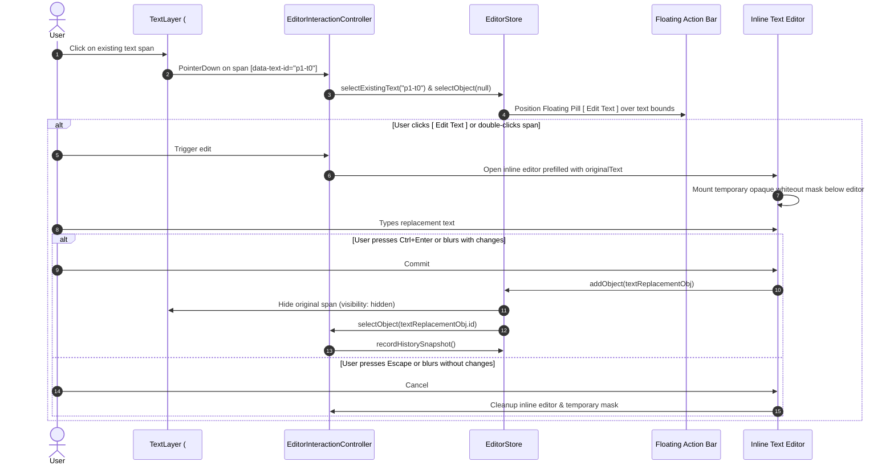

# PDF Editor — Phase 3A: Existing PDF Text Layer & Visual Text Replacement Specification

## 1. Executive Summary & Goals

Phase 3A elevates the PDF Editor from an overlay-only annotation canvas to a visual PDF editor capable of detecting, selecting, and replacing existing PDF text directly in the browser.

$$\text{CORRECTNESS} > \text{ARCHITECTURAL QUALITY} > \text{PERFORMANCE} > \text{FEATURE COUNT}$$

### Scope Boundaries
* **IN SCOPE**:
  1. Official PDF.js `TextLayer` mounted directly over `<canvas id="pdf-canvas">` for the active page.
  2. Per-page text item indexing (`ExistingPdfTextItem`).
  3. Visual text selection with mouse cursor and copy-paste clipboard support.
  4. Click / double-click to edit existing text.
  5. Automatic opaque background mask (whiteout) + replacement text overlay (`text-replacement` object).
  6. Two-way binding with `EditorInspector.astro` (replacement text, font family/size, colors, mask color).
  7. Client-side export via `pdf-lib` burning the mask and new text over the original PDF bytes.
  8. Full transactional Undo/Redo integration.
  9. Mobile responsive sheets and touch interaction.
  10. Cleaning up misleading dead controls (Redact, Underline, Strikethrough, Comment, More tools marked as Coming Soon).
  11. Memory throttling for large PDFs (e.g. 876-page, 211.7 MB).
* **OUT OF SCOPE (Deferred)**:
  - True content-stream AST text surgery.
  - Cryptographic redaction.
  - WASM PDF engines (PDFium / MuPDF).
  - Page manipulation (rotate, delete, duplicate, reorder).

---

## 2. Architecture & Layering Model

### Viewport Stacking Order (`EditorViewport.astro`)

```
┌─────────────────────────────────────────────────────────────┐
│ LAYER 4: Selection Bounding Box & Floating Action Bar       │ (z-index: 30-40, pointer-events: auto on handles/buttons)
├─────────────────────────────────────────────────────────────┤
│ LAYER 3: Editor Overlay Layer (#editor-overlay-layer)       │ (z-index: 10, pointer-events: none on container, auto on items)
├─────────────────────────────────────────────────────────────┤
│ LAYER 2: PDF.js Text Layer (#pdf-text-layer)                │ (z-index: 5, pointer-events: auto in select mode)
├─────────────────────────────────────────────────────────────┤
│ LAYER 1: PDF Canvas Bitmap (#pdf-canvas)                    │ (z-index: 0, pointer-events: none, rasterized page)
└─────────────────────────────────────────────────────────────┘
```

1. **`#pdf-render-layer`**: Contains `<canvas id="pdf-canvas">`. Renders high-DPI clamped raster pixels via `PdfPageRenderer`. `pointer-events-none`.
2. **`#pdf-text-layer`**: Transparent container managed by `pdfTextLayer.ts`. When `activeTool === 'select'`, spans capture pointer events for text selection and clicking. When creation tools are active (`text`, `rectangle`, `pen`, etc.), set to `pointer-events-none`.
3. **`#editor-overlay-layer`**: Container has `pointer-events-none` in `select` mode, but individual overlay objects (`.editor-object`) have `pointer-events-auto`. When a creation tool is active, container switches to `pointer-events-auto`.
4. **`#existing-text-action-bar`**: Lightweight floating pill that appears above/below selected existing text with an `[ Edit Text ]` action.

---

## 3. Data Structures & State Model

### A. Existing Text Item Index (`src/utils/pdfTextLayer.ts`)

```ts
export interface ExistingPdfTextItem {
  id: string; // e.g. "p1-t0"
  pageNumber: number;
  itemIndex: number;
  text: string;
  pdfBounds: {
    x: number;       // PDF points (72 dpi, top-left origin)
    y: number;       // PDF points (72 dpi, top-left origin)
    width: number;   // PDF points
    height: number;  // PDF points
  };
  fontSize: number;  // in PDF points
  fontFamily: string;// font name / fallback
  color: string;     // inferred text color (default #0f172a)
  transform: number[];// [scaleX, skewY, skewX, scaleY, transX, transY]
}
```

### B. Text Replacement Object (`src/utils/editorState.ts`)

```ts
export interface TextReplacementEditorObject extends BaseEditorObject {
  type: 'text-replacement';
  sourceTextItemId: string; // references ExistingPdfTextItem.id
  originalText: string;     // text being replaced
  replacementText: string;  // new user-provided text
  fontSize: number;         // in PDF points
  fontFamily: string;       // Inter, Helvetica, Times New Roman, Courier
  fontWeight: 'normal' | 'bold';
  fontStyle: 'normal' | 'italic';
  textDecoration: 'none' | 'underline';
  textAlign: 'left' | 'center' | 'right';
  color: string;            // text color
  backgroundColor: string;  // mask background color (default #ffffff)
  maskPadding: number;      // mask padding in points (default 2)
}
```

### C. State Extensions (`EditorStateSnapshot`)
- `selectedObjectId: string | null` (added objects)
- `selectedExistingTextId: string | null` (selected original text item)
- Methods:
  - `selectExistingText(id: string | null): void`
  - `addTextReplacement(replacement: TextReplacementEditorObject): void`

---

## 4. Interaction Lifecycle

### A. Selection & Click-to-Edit Flow



### B. Keyboard Shortcuts
- `Ctrl/Cmd + Enter`: Commit inline edit.
- `Escape`: Cancel edit (cleans up without leaving artifacts).
- `Enter`: Plain newline for multiline edits; does not accidentally commit.
- `Delete / Backspace`: Deletes selected text replacement object, immediately restoring original PDF text visibility.

---

## 5. Export Engine Integration (`pdfExportEngine.ts`)

For each `text-replacement` object on a page:
1. **Background Mask**:
   $$\text{maskY} = \text{pageHeight} - \text{obj.y} - \text{obj.height}$$
   Draw opaque white rectangle with padding ($2\text{ pt}$):
   ```ts
   page.drawRectangle({
     x: obj.x - obj.maskPadding,
     y: maskY - obj.maskPadding,
     width: obj.width + (obj.maskPadding * 2),
     height: obj.height + (obj.maskPadding * 2),
     color: parseHexColor(obj.backgroundColor, rgb(1, 1, 1)),
     opacity: 1.0,
   });
   ```
2. **Replacement Text**:
   Split text into lines; draw using embedded standard font (`Helvetica`, `HelveticaBold`, `TimesRoman`, `Courier`):
   ```ts
   page.drawText(line, {
     x: obj.x,
     y: lineY,
     size: obj.fontSize,
     font: selectedFont,
     color: parseHexColor(obj.color),
     opacity: 1.0,
   });
   ```
3. **Pristine Stream Safety**: Original content streams are preserved underneath. No metadata corruption.

---

## 6. Dead Controls & UX Honesty Cleanup

1. **Toolbar Adjustments**:
   - `Redact`: Badge with `"Coming soon"`, tooltip: `"Cryptographic redaction planned for Phase 3B"`. Disabled in UI.
   - `Whiteout`: Tooltip: `"Whiteout — Visual Covering"`.
   - `Underline`, `Strikethrough`, `Comment`: Dimmed with tooltip `"Coming soon"`.
   - `More` popover items: Tagged with `"Coming soon"` badges.
2. **Inspector Copy**:
   - Updated from misleading *"Click on any text, shape, or highlight..."* to:
     > *"Select text or an added object to edit its properties."*
   - When a `text-replacement` is selected, Inspector displays dedicated panel with editable text, font size, font family, text color, and mask color.

---

## 7. Performance & Large PDF Safety

1. **Active Page Only**: `TextLayer` is constructed strictly for `state.currentPage`. When navigating away, `textLayer.cancel()` is called and DOM nodes are cleared.
2. **No Multi-Page Indexing**: Never run `getTextContent()` across all 876 pages during file upload.
3. **Export Memory Guard**:
   - For files $> 50\text{ MB}$, bypass the redundant second `PDFDocument.load()` verification to keep peak JS heap below $500\text{ MB}$.

---

## 8. Definition of Done & Verification Plan

1. **Unit & State Verification**:
   - Text item bounds mapping matches PDF.js PageViewport at $25\%, 100\%, 400\%$.
   - Transactional Undo/Redo cleanly restores original text visibility.
2. **End-to-End Automated Browser QA** (`scripts/visual-qa-editor.js`):
   - Open Sample PDF.
   - Click "Sample Agreement — Page 1" existing text.
   - Verify floating action bar appears.
   - Trigger Edit Text, replace with "Amended Non-Disclosure Agreement".
   - Commit via `Ctrl+Enter`.
   - Verify mask covers original text and new text appears.
   - Zoom in $200\%$ and verify anchor stability.
   - Test Undo and Redo.
   - Trigger PDF Export and verify output PDF re-opens cleanly.
   - Test on 876-page PDF.
   - Capture verified screenshots across Desktop (1440px), Tablet (1024px), Mobile (390px, 320px).
3. **Regression QA**:
   - PDF Extractor at `/` must pass all automated visual and functional tests (`scripts/visual-qa.js`).
   - `tsc --noEmit` and `astro build` pass with 0 errors.
